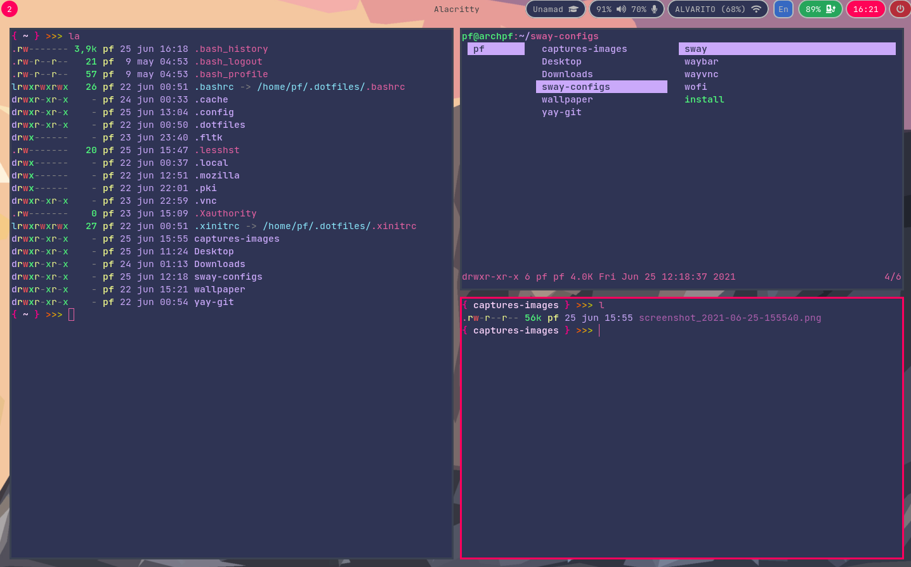

## CONFIGURATION
#### Preview:


#### It is recommended that you have the following installed:
- **Terminal** ```Alacritty```
- **Browsers** ```Firefox``` ```google-chrome```
- **File manager** ```pcmanfm```

#### The script will install the following packages:
- **Icons** ```ttf-font-awesome```
- **Window manager** ```sway```
- **Wayland bar** ```waybar```
- **Launcher** ```Wofi```
- **Brightness** ```light```
- **Screenshot** ```grim```  ```slurp```
- **Screen shared** ```wayvnc```  ```tigervnc```
- **Live viewer files Markdown** ```xdg-utils```

#### Commands:
| Keyboard shortcut | Execution |
|-------------------|-----------|
| **```super+Return```** | Alacritty |
| **```super+c```** | Selection screenshot area |
| **```super+d```** | Wofi launcher |
| **```super+e```** | Pcmanfm |
| **```super+z / super+x```** | Firefox / google-chrome |
| **```shifts_toggle```** | Change keyboard layout (us,latam) |

#### Installation:
---
1. Clone este repositorio
2. Ejecute el script: **```./install```**
